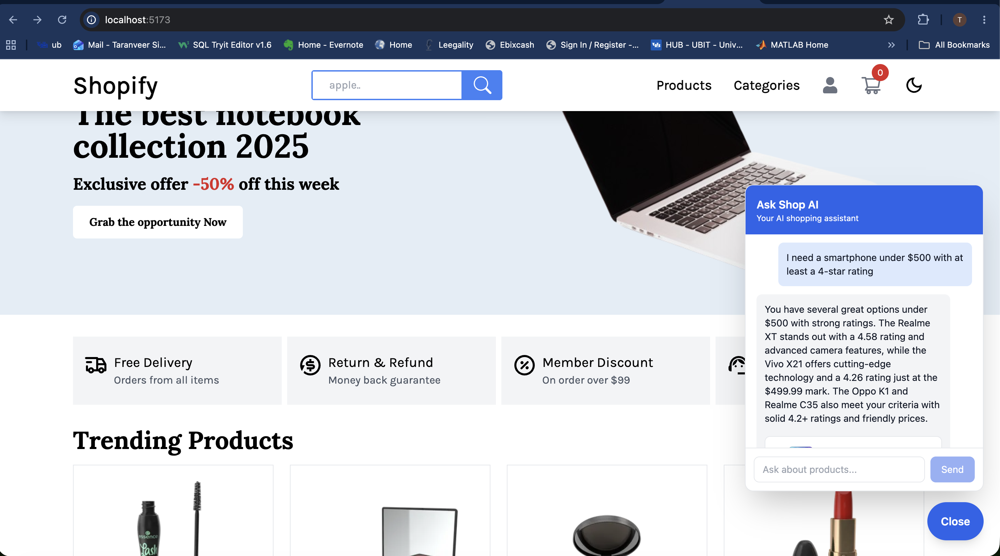
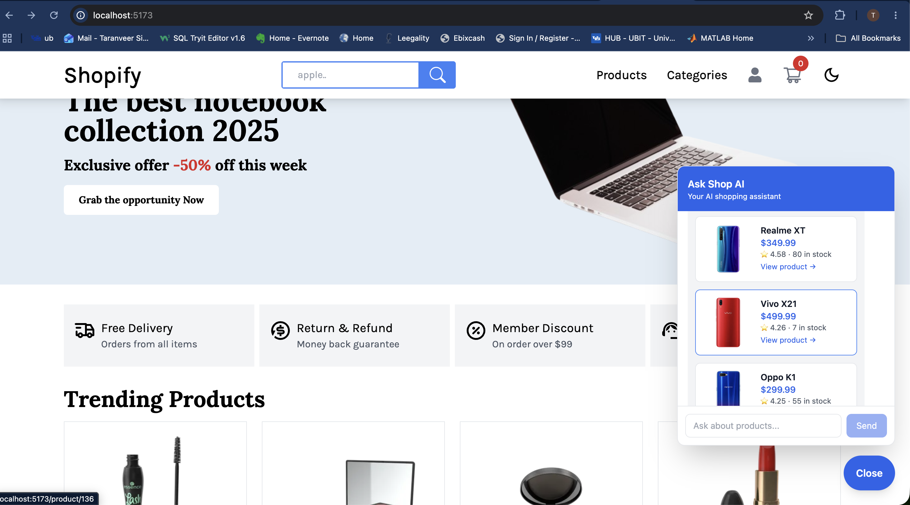
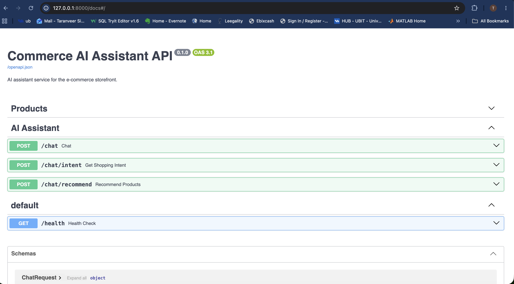
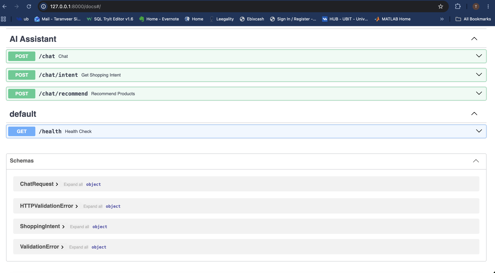

# AI-Powered E-Commerce Shopping Assistant

An AI-powered e-commerce application that combines a React storefront with a FastAPI recommendation service. The assistant understands natural-language shopping requests, performs semantic product retrieval using ChromaDB, applies structured constraints, reranks relevant products with an LLM, and returns grounded recommendations directly in the shopping interface.

## Demo

### Natural-Language Shopping Assistant

Users can describe what they are looking for in plain English. The assistant extracts shopping constraints and generates a grounded recommendation from the product catalog.



### AI Product Recommendations

Retrieved products are displayed directly in the storefront with product images, prices, ratings, stock availability, and links to product pages.



### FastAPI Backend

The AI service exposes REST endpoints for product access, conversational AI, structured intent extraction, RAG-based recommendations, and service health monitoring through FastAPI.



### API Schemas

FastAPI automatically generates interactive OpenAPI documentation and request/response schemas for components such as `ChatRequest` and `ShoppingIntent`.



## Features

- Natural-language AI shopping assistant integrated into the storefront
- Structured intent extraction for category, budget, rating, and search criteria
- Semantic product search using ChromaDB vector embeddings
- Retrieval-Augmented Generation (RAG) over the product catalog
- Product filtering based on price, category, rating, and availability
- LLM-based reranking of retrieved products
- Grounded AI responses based only on retrieved product information
- Interactive recommendation cards with product images, prices, ratings, and stock
- Direct navigation from AI recommendations to product detail pages
- FastAPI REST API with input validation and error handling
- Automated API tests with pytest
- Dockerized AI backend with persistent ChromaDB storage

## Architecture

```text
User
  │
  ▼
React + TypeScript Storefront
  │
  │ POST /chat/recommend
  ▼
FastAPI AI Service
  │
  ├──► Intent Extraction
  │       └── Category / Budget / Rating / Search Query
  │
  ├──► ChromaDB Semantic Search
  │       └── Retrieve relevant catalog candidates
  │
  ├──► Constraint Filtering
  │       └── Price / Category / Rating / Stock
  │
  ├──► LLM Reranking
  │       └── Select the most relevant products
  │
  └──► Grounded Response Generation
          │
          ▼
AI Recommendation + Structured Product Data
          │
          ▼
React Product Recommendation Cards
```

## Recommendation Pipeline

When a user enters a request such as:

> "I need a smartphone with a good camera under $500"

the system:

1. Extracts structured shopping intent from the request.
2. Converts the request into a semantic product search.
3. Retrieves relevant candidates from the ChromaDB vector store.
4. Applies explicit constraints such as category, maximum price, minimum rating, and stock availability.
5. Reranks the remaining products using the LLM and product descriptions.
6. Generates a concise response grounded in the selected catalog data.
7. Displays the recommended products as interactive cards in the storefront.

## Tech Stack

### Frontend
- React
- TypeScript
- Vite
- Redux Toolkit
- Tailwind CSS

### AI & Backend
- Python
- FastAPI
- OpenAI API
- Pydantic
- HTTPX

### RAG & Search
- ChromaDB
- Vector Embeddings
- Semantic Search
- Retrieval-Augmented Generation (RAG)
- LLM Reranking

### DevOps & Testing
- Docker
- Docker Compose
- pytest
- Git / GitHub

### Product Data
- DummyJSON Products API

## Project Structure

```text
simple-react-ecommerce/
│
├── ai-service/
│   ├── app/
│   │   ├── api/
│   │   │   ├── chat.py
│   │   │   └── products.py
│   │   │
│   │   ├── services/
│   │   │   ├── ai_service.py
│   │   │   ├── intent_service.py
│   │   │   ├── product_service.py
│   │   │   └── vector_service.py
│   │   │
│   │   └── main.py
│   │
│   ├── tests/
│   │   ├── test_chat.py
│   │   └── test_health.py
│   │
│   ├── Dockerfile
│   ├── compose.yaml
│   ├── index_products.py
│   ├── requirements.txt
│   └── .env.example
│
├── src/
│   ├── components/
│   │   └── AIChatWidget.tsx
│   ├── aiApi.ts
│   └── App.tsx
│
└── README.md
```

## Getting Started

### 1. Clone the Repository

```bash
git clone https://github.com/alim1496/simple-react-ecommerce.git
cd simple-react-ecommerce
```

If you are using a fork of this project, clone your fork instead.

### 2. Install Frontend Dependencies

```bash
npm install
```

Start the frontend:

```bash
npm run dev
```

The application will be available at:

```text
http://localhost:5173
```

## AI Service Setup

Move into the backend:

```bash
cd ai-service
```

Create a Python virtual environment:

```bash
python3 -m venv .venv
source .venv/bin/activate
```

Install dependencies:

```bash
pip install -r requirements.txt
```

Create the environment file:

```bash
cp .env.example .env
```

Then add your OpenAI API key to `.env`:

```text
OPENAI_API_KEY=your_openai_api_key_here
```

Do not commit the `.env` file.

### Index the Product Catalog

Before using semantic recommendations, index the product catalog into ChromaDB:

```bash
python index_products.py
```

### Start the AI Service

```bash
uvicorn app.main:app --reload --port 8000
```

The API will run at:

```text
http://127.0.0.1:8000
```

Interactive API documentation:

```text
http://127.0.0.1:8000/docs
```

## Docker Setup

The AI service can also run in Docker.

Create the persistent ChromaDB volume:

```bash
docker volume create commerce-ai-chroma
```

Build and start the service:

```bash
docker compose up --build
```

If the vector database has not been initialized yet, run:

```bash
docker exec commerce-ai python index_products.py
```

The ChromaDB index is stored in the persistent Docker volume and survives container restarts.

Stop the service with:

```bash
docker compose down
```

## API Endpoints

| Method | Endpoint | Description |
|---|---|---|
| GET | `/health` | Check AI service health |
| GET | `/products` | Retrieve products |
| GET | `/products/search` | Search the product catalog |
| POST | `/chat` | Basic AI conversation |
| POST | `/chat/intent` | Extract structured shopping intent |
| POST | `/chat/recommend` | Generate RAG-based product recommendations |

## Testing

Run the backend test suite from `ai-service`:

```bash
python -m pytest tests/ -v
```

The tests cover:

- Health endpoint behavior
- Empty-message validation
- Whitespace-only message validation
- Recommendation endpoint behavior using mocked AI/search dependencies

## Example Request

```json
{
  "message": "I need a smartphone with a good camera under $500"
}
```

The recommendation endpoint returns structured intent, an AI-generated summary, and product data that the React frontend renders as recommendation cards.

## Key Engineering Concepts

This project demonstrates:

- Full-stack AI application integration
- REST API design with FastAPI
- Retrieval-Augmented Generation (RAG)
- Vector search and embeddings
- Structured LLM outputs
- Semantic retrieval combined with deterministic filtering
- LLM-based product reranking
- Grounded response generation
- React-to-Python API integration
- Docker containerization and persistent vector storage
- API validation and automated testing

## Data Source

Product catalog data is provided by [DummyJSON](https://dummyjson.com/).

## Acknowledgements

The storefront is based on the open-source `simple-react-ecommerce` project by [alim1496](https://github.com/alim1496/simple-react-ecommerce). The AI recommendation service, RAG pipeline, semantic search, LLM integration, recommendation interface, testing, and Docker setup were added as part of this project.